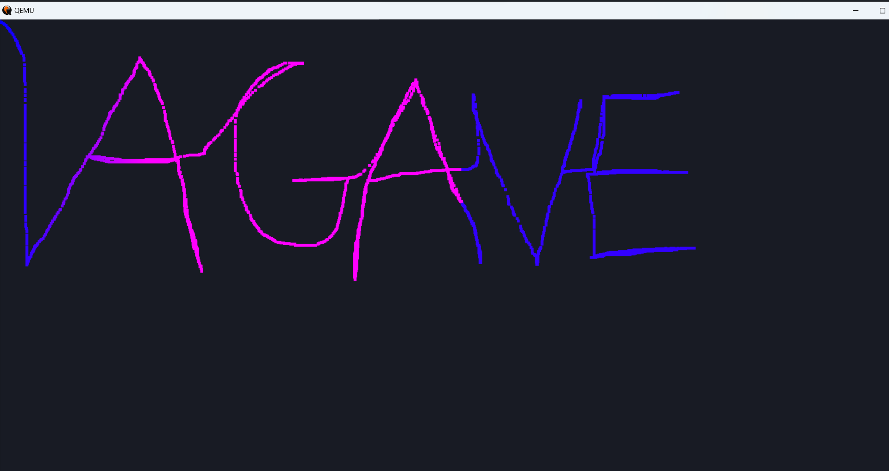

#  Agave OS

Agave OS is a simple operating system written in Rust with wasi support. It is designed to be lightweight and easy to use. It is also designed to be easy to customize and extend. Started from [Fomos](https://github.com/Ruddle/Fomos) and the second edition of
[Writing an OS in Rust](https://os.phil-opp.com/) by Philipp Oppermann. Also contains code from [Theseus OS](https://github.com/theseus-os/Theseus)

## Features

- Lightweight and fast
- Supports a wide range of hardware platforms
- Easy to use and customize
- Built with Rust and wasi for maximum performance and security

## WASM apps

```rs
use agave_lib::{draw_circle, get_dimensions, Position, RGBA};

#[no_mangle]
pub extern "C" fn update(mouse_x: i32, mouse_y: i32) {
    let dim = get_dimensions();

    draw_circle(
        Position { x: mouse_x, y: mouse_y },
        10,
        RGBA {
            r: if mouse_x >= dim.width / 2 { 50 } else { 255 },
            g: 0,
            b: 255,
            a: 255,
        },
    );
}


```



## Maintainers

- Dean Srebnik ([@load1n9](https://github.com/load1n9))
