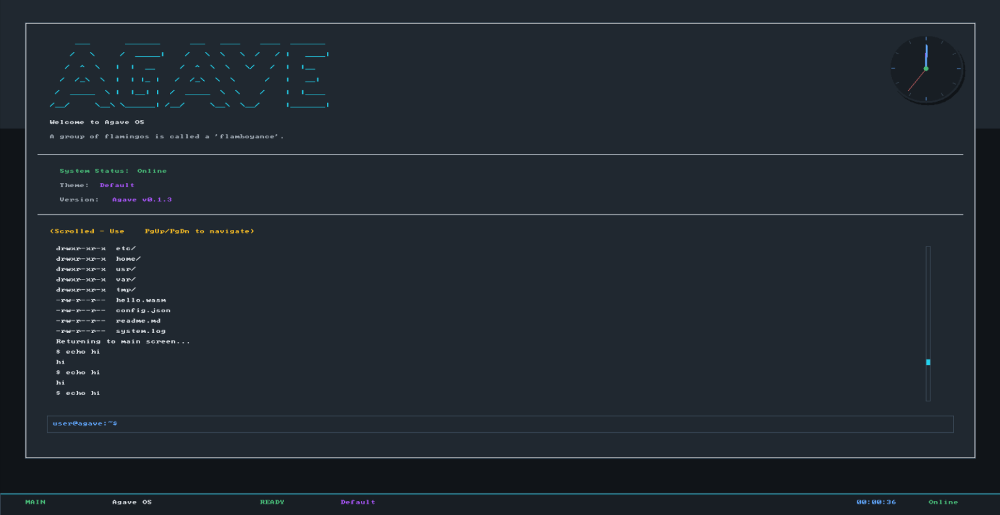

# Agave OS


Agave OS is a simple operating system written in Rust with WASI support. It is designed to be lightweight, fast, and easy to use. It is also designed to be easy to customize and extend. Started from [Fomos](https://github.com/Ruddle/Fomos) and the second edition of
[Writing an OS in Rust](https://os.phil-opp.com/) by Philipp Oppermann. Also contains code from [Theseus OS](https://github.com/theseus-os/Theseus).

## 🚀 Try the Web Demo

Experience Agave OS' desktop environment directly in your browser—no installation required!  
[Launch the Web Demo](https://agave.load1n9.deno.net/)

- Explore the desktop environment
- Test graphics, animations, and system features interactively
- Works on most modern browsers
- Contributions and bug reports are welcome! (barely works so far keyboard input needs fixing)

## Core Features

- **Lightweight and fast** - Minimal overhead with efficient memory management
- **Hardware support** - Supports a wide range of x86_64 hardware platforms
- **Easy to customize** - Modular architecture for easy extension
- **Built with Rust** - Memory safety and performance with zero-cost abstractions

## 🎨 Enhanced Graphics & WASM

- **Rich Graphics API** - Circles, rectangles, lines, triangles with color support
- **Animation Support** - Time-based animations and smooth transitions
- **Interactive Applications** - Mouse input and real-time interaction
- **WASM Runtime** - Execute WebAssembly applications with comprehensive API

## ⚡ Advanced System Features

- **Priority Task Scheduling** - Multi-level priority queues with fair scheduling
- **Memory Management** - Advanced allocator with statistics and leak detection
- **Error Handling** - Comprehensive error types with recovery strategies
- **System Monitoring** - Real-time performance metrics and health monitoring
- **Profiling Tools** - Built-in profiler for performance analysis

## 🛠️ Development Tools

- **Enhanced Diagnostics** - Detailed panic information with system state
- **Memory Tracking** - Allocation statistics and pressure monitoring
- **Performance Events** - Event logging for optimization insights
- **Build Scripts** - Automated build process with testing support

## WASM Applications

Enhanced WASM applications now support rich graphics and animations:

```rust
use agave_lib::{
    clear_screen, draw_circle, fill_circle, draw_triangle, 
    get_dimensions, get_time_ms, Position, RGBA
};

#[no_mangle]
pub extern "C" fn update(mouse_x: i32, mouse_y: i32) {
    let dim = get_dimensions();
    let time = get_time_ms();
    
    // Clear with animated background
    clear_screen(RGBA::new(10, 10, 20, 255));
    
    // Draw animated elements
    let phase = (time as f32 / 1000.0) * 2.0 * 3.14159;
    let center = Position::new(dim.width / 2, dim.height / 2);
    let radius = 50 + (phase.sin() * 20.0) as i32;
    
    fill_circle(center, radius, RGBA::new(255, 100, 150, 200));
    
    // Interactive mouse following
    fill_circle(
        Position::new(mouse_x, mouse_y),
        15,
        RGBA::new(100, 255, 100, 255)
    );
}
```


## 🔧 Building and Running

```powershell

# Use deno for tasks
deno task run-all

# Or use nu for tasks
nu agave.nu run-all

# Or use bash for tasks
./agave.sh run-all

# Or use powershell for tasks
./agave.ps1 run-all

# Or use cmd for tasks
./agave.bat run-all

```

### Prerequisites

- Rust nightly toolchain
- QEMU (for running the OS)

### Quick Start

```powershell
deno task run-all
```

## 📊 System Monitoring

The OS includes comprehensive monitoring capabilities:

- **Memory Statistics** - Allocation tracking, peak usage, fragmentation analysis
- **Task Metrics** - Spawn/completion rates, execution time, context switches
- **Performance Events** - Memory pressure, queue status, performance anomalies
- **Health Monitoring** - Automatic detection of system issues
- **Profiling** - Function-level performance measurement

## 🏗️ Architecture

### Core Components

- **Kernel** (`crates/kernel`) - Core OS functionality
- **API** (`crates/api`) - System APIs and drivers
- **Library** (`crates/lib`) - WASM application library
- **Applications** (`apps/`) - WASM applications

### Enhanced Systems

- **Error Handling** (`sys/error.rs`) - Comprehensive error types
- **Memory Management** (`sys/allocator.rs`) - Advanced allocation tracking
- **Task Scheduling** (`sys/task/`) - Priority-based async execution
- **System Monitoring** (`sys/monitor.rs`) - Performance and health tracking
- **WASM Runtime** (`sys/wasm.rs`) - Enhanced WebAssembly execution

## 🐛 Debugging

Enhanced panic handler provides detailed system information:

- System uptime and current state
- Memory usage and allocation statistics
- Task execution metrics
- Recent performance events

## 🤝 Contributing

Contributions are welcome! Areas for improvement:

- Additional graphics primitives
- Network stack implementation
- Filesystem enhancements
- Hardware driver support
- Performance optimizations

## Maintainers

- Dean Srebnik ([@load1n9](https://github.com/load1n9))
